# Mangalyaan — ISRO Mars Orbiter Mission Animation

Mangalyaan is a five-minute 2D OpenGL animation that explains the journey of
India's Mars Orbiter Mission (MOM). It visualizes the PSLV launch, atmospheric
ascent, stage separation, the direct-trajectory failure scenario, Earth's
gravity-assist solution, trans-Mars injection, Mars orbit insertion, science
operations, data transmission, and the successful mission finale.

The animation is written in C and uses OpenGL with GLUT/freeglut. All scenes
are drawn procedurally at runtime, so no asset downloads are required.

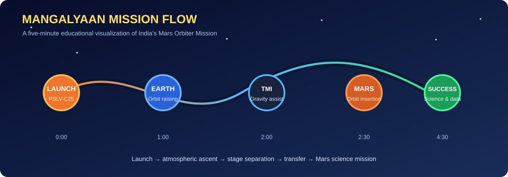

## Screenshots

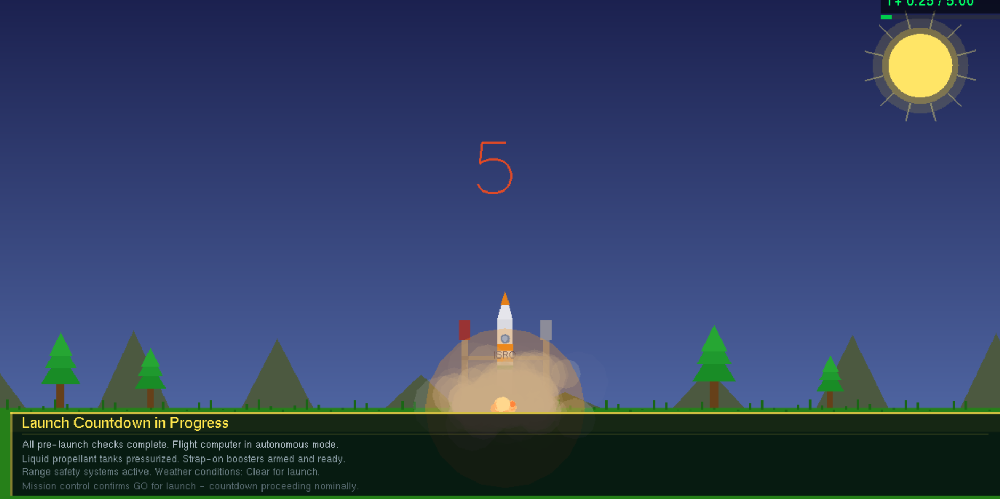
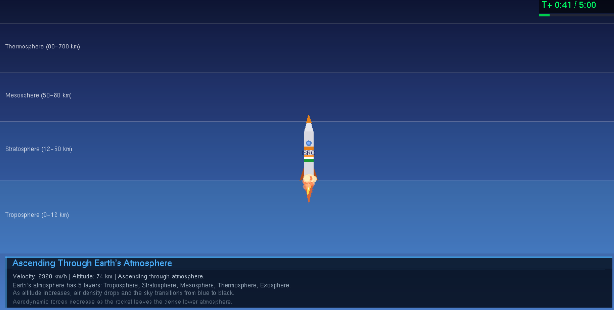
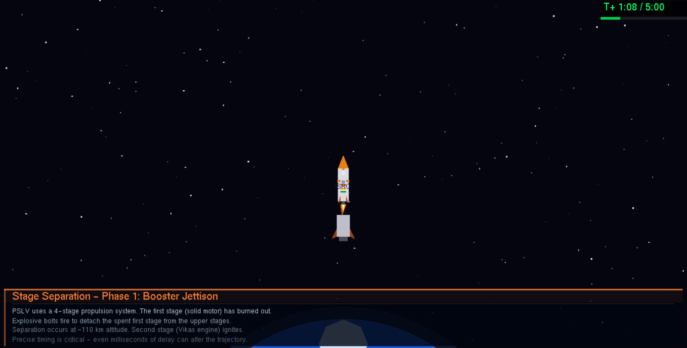
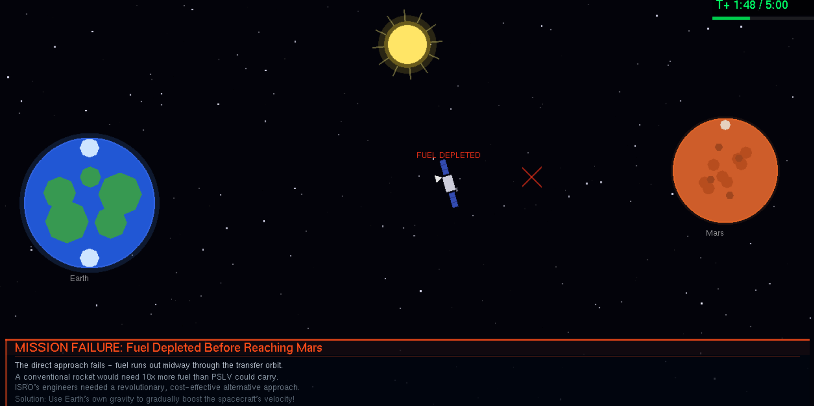
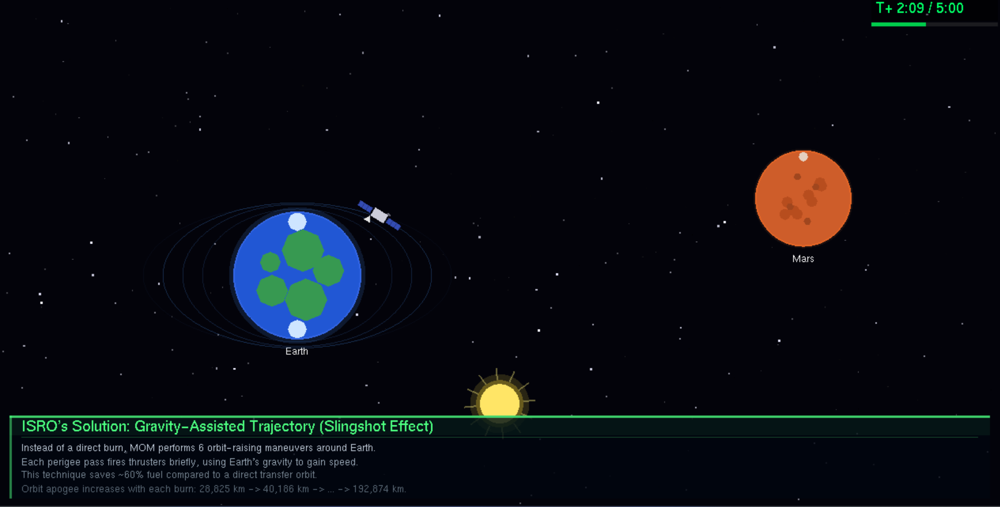
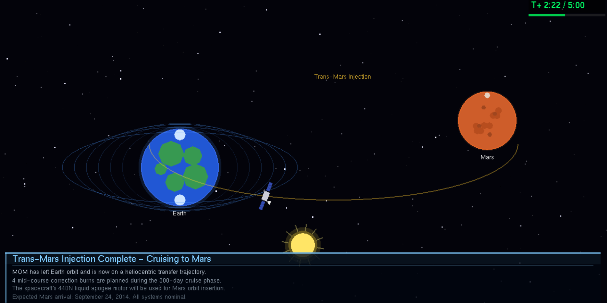
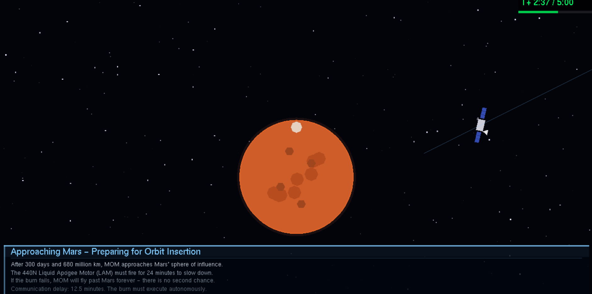
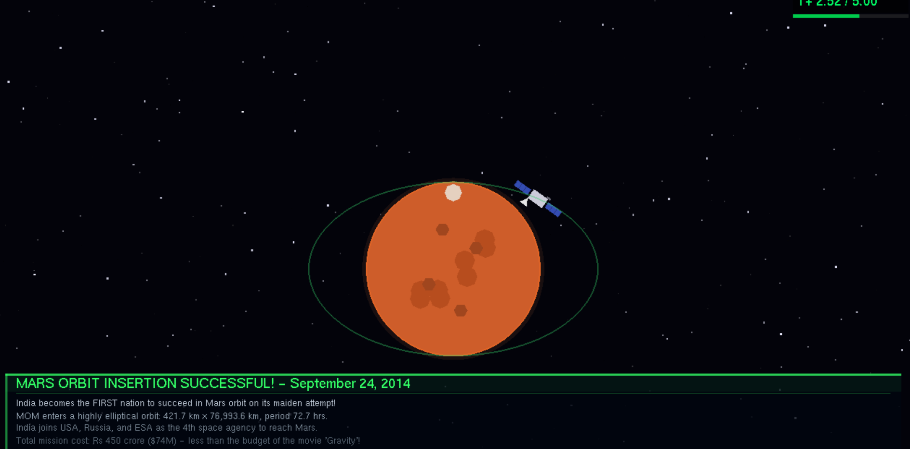
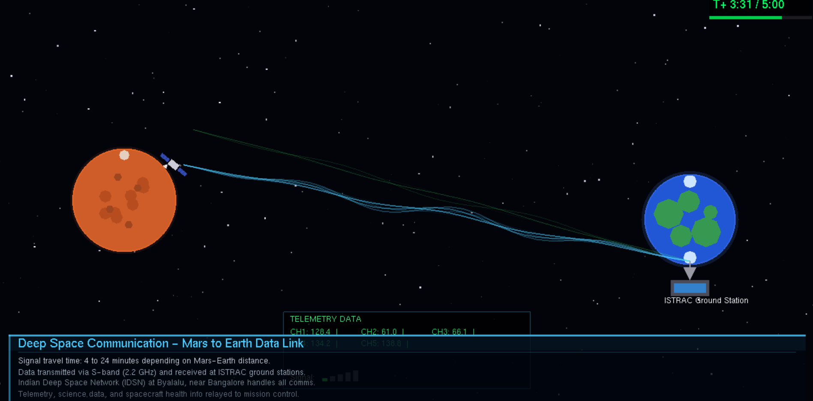
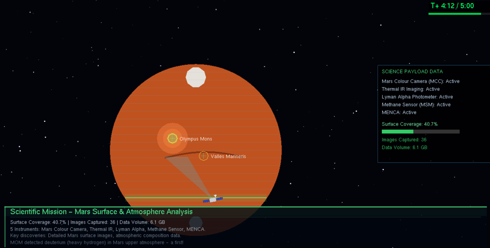
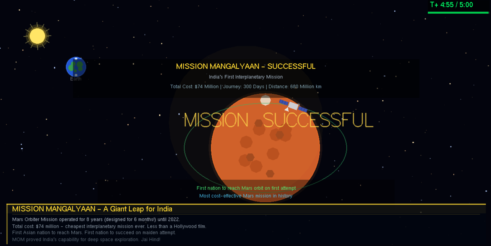

## Highlights

- Procedural 2D rocket, Earth, Mars, Sun, stars, trajectories, flames, smoke,
  telemetry, and information panels.
- A complete 300-second mission narrative with educational captions.
- Animated comparison between a fuel-limited direct approach and the
  gravity-assisted trajectory used by MOM.
- Resizable OpenGL window with a default size of 1200 × 800.

## Scene timeline

| Time | Scene |
| --- | --- |
| 0:00–0:10 | Rocket on launch pad |
| 0:10–0:20 | Engine ignition |
| 0:20–0:30 | Countdown |
| 0:30–0:40 | Liftoff |
| 0:40–1:00 | Atmospheric ascent |
| 1:00–1:30 | Stage separation |
| 1:30–2:00 | Direct approach failure |
| 2:00–2:30 | Gravity-assist solution |
| 2:30–3:00 | Mars orbit insertion |
| 3:00–3:30 | Mars orbital visualization |
| 3:30–4:00 | Mars-to-Earth data transmission |
| 4:00–4:30 | Mars surface and atmosphere scanning |
| 4:30–5:00 | Mission success finale |

## Requirements

- Windows with an OpenGL-capable graphics driver
- MinGW-w64 (`gcc` and `g++`/runtime tools)
- FreeGLUT development files for MinGW-w64

The project was run on Windows using the MinGW toolchain (referred to as
MinGW4 in the original setup).

The source includes the Windows link libraries expected by the project:
`freeglut`, `opengl32`, `glu32`, and the math library.

## Build and run with MinGW-w64

Open **MSYS2 MinGW 64-bit** (or a terminal where the MinGW-w64 `bin`
directory is on `PATH`), then run these commands from the project directory:

```bash
gcc animation.c -o animation.exe -lfreeglut -lopengl32 -lglu32 -lm
./animation.exe
```

On a native Windows Command Prompt, run the executable with:

```bat
animation.exe
```

If the compiler cannot find `GL/glut.h` or `-lfreeglut`, install/configure
FreeGLUT for the same MinGW-w64 environment and ensure its `include` and
`lib` directories are available to the compiler. Mixing 32-bit and 64-bit
FreeGLUT files can cause linker errors, so use libraries matching your GCC
architecture.

## Controls and playback

The program starts immediately and advances automatically through the
five-minute sequence. Resize the window to view the responsive scene. Close
the OpenGL window to exit.

## Project files

```text
.
├── animation.c          # C/OpenGL/GLUT source
├── animation.exe        # Existing Windows build
├── docs/
│   └── mission-flow.svg  # README overview graphic
└── README.md
```

## Note

This is an educational visualization, not a flight simulator. Distances,
timings, trajectories, and mission captions are simplified for storytelling.
